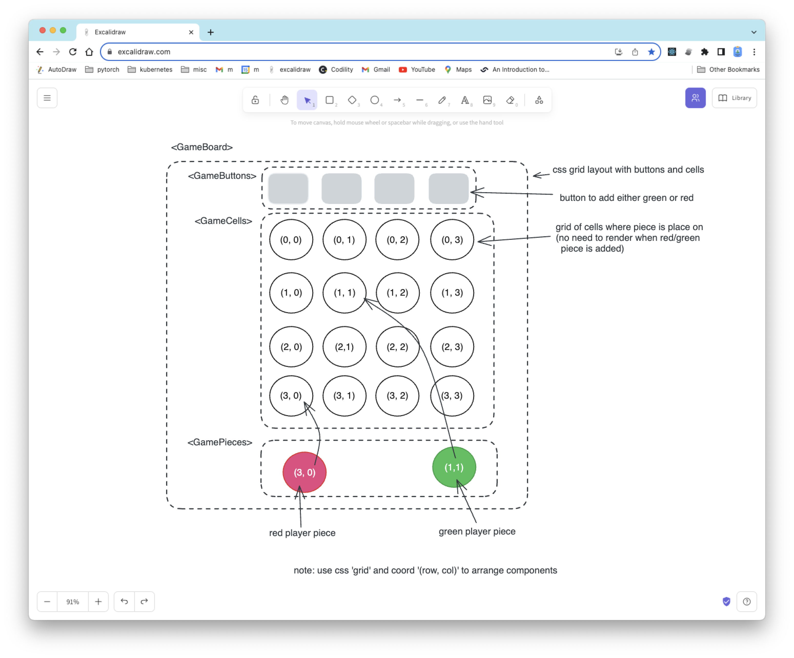
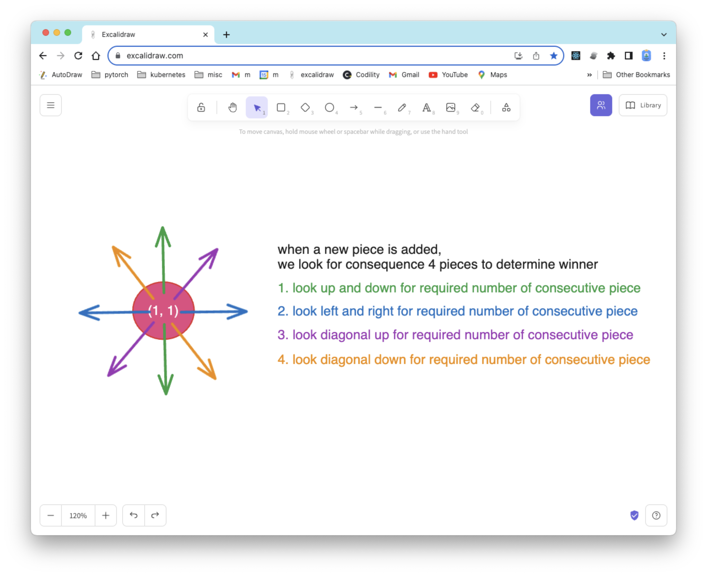
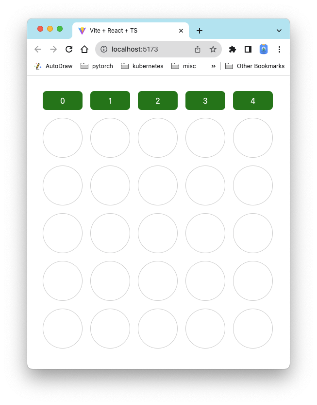
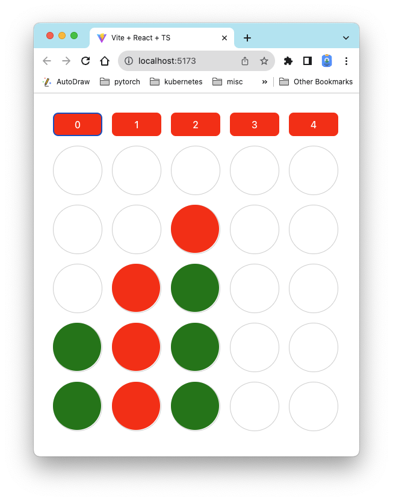
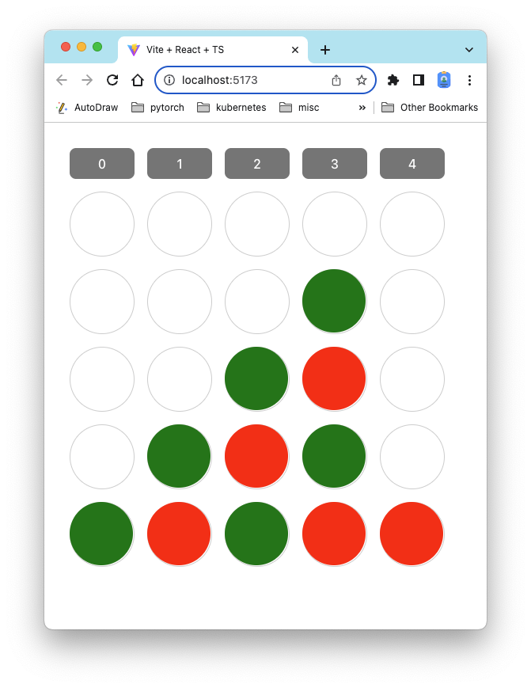

# Connect Four

1. a board game of matrix size `n` columns and `m` rows.
1. each player takes turn to place its piece on the boad.
1. player can click the cell to place a player's piece to the board.
1. a player win the game if the player has placed continuous `c` number of the player's pieces in a vertical, horizontal, or diagonals.

# Component Layout

1. use css `display: grid` for the game board,we then use `grid-area: f(x,y)` to layout cells and pieces, and finally use `grid-area: g(x,y)` to layout buttons. This approach makes all added component once-render only (no re-render needed for cells or pieces, avoiding `O(n x m)` rendering)

1. note: we could add player turn boxes about buttons, and make the buttons once-render to avoid `O(n)` rendering

# State and Functions
1. use context/hook to manage state between components
1. use pure functions to transform state from one  to another state
1. when a new piece is added, we then search for the adjacent consecutive piece of the same player. there are vertical (up and down) as shown in green arrows, horizontal (left, right) as shown in blue arrows, diagonal rise (down-left, up-right) as shown in purple arrows, diagonal fall (up-left, down-right) as shown in orange arrows,

# Screenshots
1. fresh game 

1. an example of red and green player take turns

1. example of green use reach 4 count first

